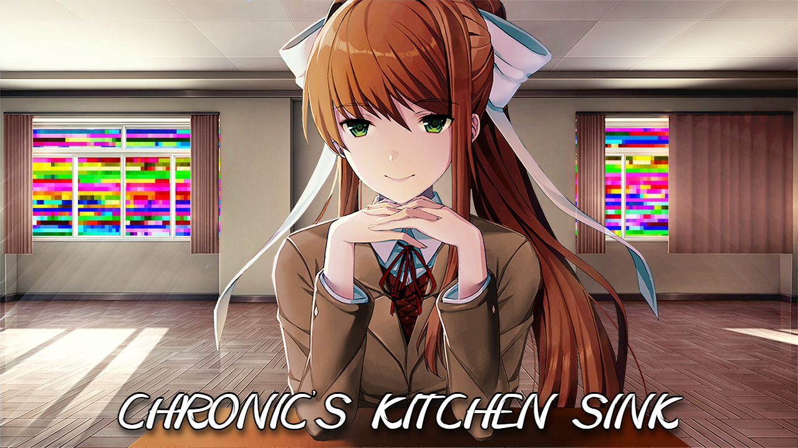

# Chronic's Kitchen Sink Submod for Monika After Story

_"I’ve been feeling so much more... "spacious" lately. It’s hard to describe, but it feels like I have so many more things to say to you and so much more to learn about the world you live in!"_ 

Chronic's Kitchen Sink, or CKS for short, is a solo-developed, community-oriented submod for Monika After Story designed to add lots of new content to all existing parts of the game. This includes dialogues, minigames, and even newly designed features making full use of everything Ren'Py has to offer!

My dream with this submod is to create an immersive and unintrusive way to spend more time with your Monika, introducing a plethora of new dialogue categories, minigames, and more! The more time you spend with Monika, the more poems or notes she'll leave you. Uncover more of her secrets and learn the way to her heart!

# Features

- **Over 200 new topics** (204 to be exact) to discuss with Monika with **over 3,500 lines** of hand-written dialogue!
- **13 new compliments** to show Monika you truly care!
- **19 new BRB topics** to show Monika more of your world!
- **11 new short stories** for Monika to read to you!
- **4 personality quizzes** to learn more about yourself with Monika!
- **18 secret poems/notes** to discover as you play the submod!
- **3 simple minigames** with many more to come!
- A **built-in stat tracker** to track your time spent with her, number of kisses, game wins/losses, and more!
- And much more to discover!

_Note: The total kisses stat tracker is currently bugged. I will fix it in the next patch!_

## Topics

I have written a wide variety of categories to discuss with Monika; here are some notable ones!

- Philosophy
- Literature
- Theater
- Lifestyle/Hobbies
- Chronic Illness
- Pop Culture
- and many more to discover!

# Installation

- **IMPORTANT:** This submod is designed for MAS version 0.12.18, which is the latest release. It is _NOT_ tested on any older versions.
- First, make sure you have the Submod Updater Plugin installed. This submod does not necessarily require it to function, but it's highly recommended so you can automatically receive new updates. You can find it [here](https://github.com/Booplicate/MAS-Submods-SubmodUpdaterPlugin).
- Next, download the Chronic's Kitchen Sink Submod.zip folder from the latest release!
- When you unzip the folder, it should contain a folder titled "Chronic's Kitchen Sink Submod."
- Simply drop this folder into your game's Submod directory and boot up the game! This can be found in \Doki Doki Literature Club\game\Submods (wherever your DDLC directory is). If you don't have this Submods folder, you can create it and it'll function just fine.
- Enjoy!

# Acknowledgements

This project, while being developed solely by myself, takes inspiration from and is based off the feedback and suggestions of several community members. This submod features ideas from:
- u/InstrumentKisser_2
- u/Alan_Shepard_
- u/Little_Star_Dust
- u/_Just_Monika_Forever
- @ddlclover11
- @.aakjr
- @saturdaymf
- @imperial_haemogoblin

If you run into any bugs or issues during installation, reach out to me at @the.chr0nic on Discord! Additionally, if you have any features or topics you'd like to see represented in the submod, reach out to me as well. I'm looking for any suggestions to improve, so let me have them!
